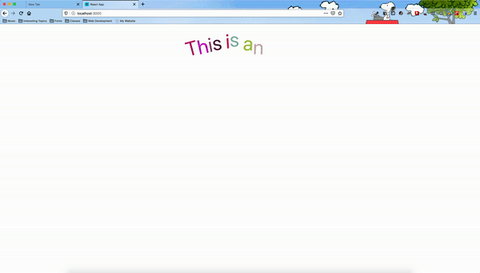

<h1 align="center"> react-swervy-text :curly_loop: </h1>
<div align="center"> A npm package that provides an easy implementation for text to be animated along shapes and curves </div>

## :see_no_evil: Preview

</img>

## 📦 Installation 

```bash
# with npm
npm install react-swervy-text

# with yarn
yarn add react-swervy-text
```

## Usage


```jsx
import React from "react";
import { Arc, Circle, Rectangle, Snake, CustomPath } from "react-swervy-text";
import "./styles.css";
function App() {
  return (
    <div>
      <div style={{ marginTop: "3rem" }}>
        <Arc text={"This is an arc"} fontSize={"5rem"} />
      </div>

      <div style={{ marginTop: "9rem", display: "flex", justifyContent: "center" }}>
        <Circle
          delay={2}
          text={"Circle"}
          timingFunction="linear"
          fontSize="3rem"
        />
        <Rectangle
          delay={4}
          text={"Rectangle"}
          x={100}
          fontSize={"3rem"}
          s1={200}
          s2={100}
          direction={"Reverse"}
          timingFunction="quadratic"
        />
      </div>
      <div style={{ marginTop: "12rem" }}>
        <Snake
          delay={6}
          text={"This is the snake component!"}
          fontSize={"5rem"}
        />
      </div>

      <div style={{ marginTop: "4rem" }}>
        <CustomPath text={"Curve"} delay={8} />
      </div>
    </div>
  );
}

export default App;

```
[](https://codesandbox.io/s/react-swervy-text-demo-0qk9s)


### Props
#### All Components:
* <div><b>fontSize</b> sets the font size of the component, ex. "5rem", "2px"</div>
* <div><b>delay</b> accepts a number for how long in seconds to wait for the animatiion to begin. </div>
* <div><b>text</b> accepts a string for the text that the component should show.</div>
* <div><b>delayConst</b> accepts a number for the amount of time to pass before a letter is shown.</div>
* <div><b>colors</b> accepts an array of hex color strings. Each element is the color that will be applied to the respective letter. If the length of the array is less than the number of characters, the colors will be repeated. If no color is given, then random colors will be generated for each letter.</div>
#### Only for Rectangle, Circle, and CustomPath Components:
* <div><b>loop</b> accepts a string or number for the number of cycles to run. ex. 2, 5, "infinite" </div>
* <div><b>period</b> accepts a number for how long one cycle of the animation should last. </div>
* <div><b>playState</b> accepts a string of either "running" or "paused".</div>
* <div><b>distance</b> accepts a string that represents what percent of the loop is to be finished. ex. "50%".</div>
* <div><b>timingFunction</b> accepts a string that represents what function to run for the animation. ex. "linear", "quadratic", "cubic", "cubic-bezier(.65, .05, .36, 1)".</div>
* <div><b>direction</b> accepts a string that represents the direction for the animation. ex. "normal", "reverse", "alternate", "alternate-reverse".</div>
#### Only for Rectangle and Circle Components:
* <div><b>x</b> accepts a number for how many px to the right for the animation to begin. </div>
* <div><b>y</b> accepts a number for how many px down for the animation to begin. </div>
#### Only for Rectangle Component:
* <div><b>s1</b> accepts a number for how long the first side should be. </div>
* <div><b>s2</b> accepts a number for how long the second side should be. </div>
#### Only for Circle Component:
* <div><b>r</b> accepts a number for how big the radius of the circle should be. </div>
#### Only for CustomPath Component:
* <div><b>Path</b> accepts a string for the path. ex. "M1 46C74.6667 12.3333 247.2 -34.8 348 46C448.8 126.8 640.667 79.6667 724 46"  </div>
#### Only for Arc and Snake Components:
* <div><b>heightIncrement</b> accepts a number for the difference in height between two consecutive letters. </div>
#### Only for Arc Component:
* <div><b>rotate</b> accepts a boolean for if the letters should be rotated. </div>
* <div><b>startingRot</b> accepts a number (in degrees) what the rotation should be on the first letter. </div>
#### Only for Snake Component:
* <div><b>lenOfEachIncrement</b> accepts an int number for the number of characters in each upwards and downwards section of the snake. </div>

## Built With
* <a href="https://reactjs.org/">React.js</a>
* <a href="https://styled-components.com/">Styled-Components</a>
* <a href="https://www.framer.com/motion/">Framer-Motion</a>